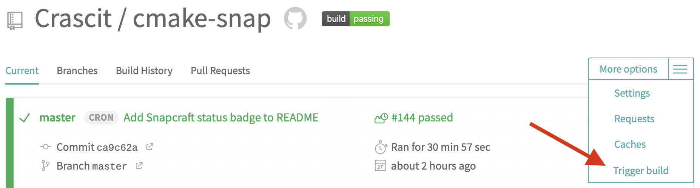
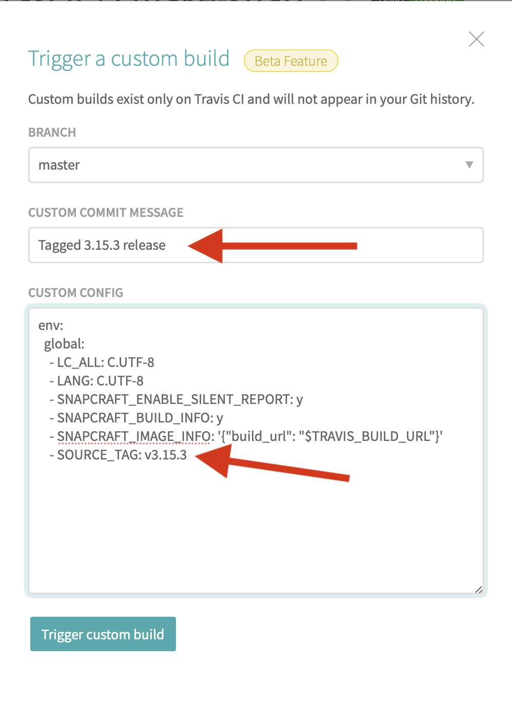

image::snap/gui/CMake_Logo_wide.svg[CMake]

This is the snap for CMake, a cross-platform, open-source build system generator.

image::https://snapcraft.io/cmake/badge.svg[link="https://snapcraft.io/cmake"]

# Release Instructions

When an official CMake release is made, a manual job has to be triggered
in Travis CI:

This will bring up the following dialog, with important fields/contents
indicated by arrows (the screenshot shows the correct way to trigger a
build for the CMake 3.15.3 release as an example):

The *Commit message* field is only used as the message for the build, it is
not actually used to make any sort of commit. It is being used to override
the commit message of the commit that is being checked out. Use a message
of the form "Tagged X.Y.Z release".

By default, the build will pick up latest CMake master. For releases, the
release tag needs to be used instead. This is achieved by copying the
`env` block from the `.travis.yml` file and appending a `SOURCE_TAG` with
a value of the form `vX.Y.Z` (note the leading `v`), which must exactly
match the git tag used for the release in CMake's git repository.

With the above information filled in, trigger the build by clicking the
button at the bottom of the dialog. If the build is successful, it will
automatically deploy the resultant snap to the X.Y channel as the *edge*
build. This can then be tested on a Linux system and once you have
confirmed that the package is okay, it can be promoted to the stable
release for that channel (this is done in the snapcraft.io website, not
travis CI). If this is the latest release, then it should also be set as
the stable release in the `latest` channel.
